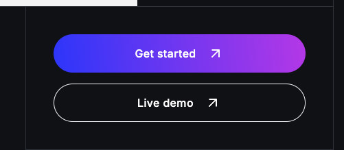

# Aprendiendo ASTRO

## Caracteristicas de Astro
  * Rendimiento optimizado por defecto
  * Experiencia al desarrollador
  * SEO Friendly
  * ECMAScript moderno y Typescript
  * Extensibilidad y personalización
  * Crece acorde a la necesidad


## Código que podemos generar con Astro
  * __Static Site Generation__: - Se genera en just in time 
  * __Server Side Rendering__: - Renderizado del lado del servidor
  * __Hybrid__:  - Hibrido entre STG & SSR
  * __Multi-Page Applications__: - Es diferente a un SPA, es una aplicación con multiples páginas en las que podemos compartir estado
  * __Client-side rendering__: - Para poder utilizar una libreria o Framework de UI

## Herramientas que nos brinda Astro
1. Server Actions
2. Astro DB
3. View Transitions
4. Pre-fetch
5. Vite - Funciona con el compilador de Vite
6. Middlewares
7. Mucho más


## Contras de Astro
1. SPA's (Single page applications) no es su enfoque, para esto mejor usar los frameworks tradicionales
2. La comunidad va creciendo, pero no es tan grande aún
3. La interactividad es un trabajo manual que depende de Vanilla Javascript/Typescript o UI Frameworks (Islas)
4. Integrar frameworks o librerias de UI, requiere tener las bases de esas tecnologias.

<br>

## Como se estructura un proyecto en Astro
[Estructura de proyecto](https://docs.astro.build/es/basics/project-structure/)

<br>

## Como gestionar las preferencias del usuario (dev)

Gestiona las preferencias de usuario con el comando astro preferences

[Astro preferencias](https://docs.astro.build/es/reference/cli-reference/#astro-preferences)

<br>

## Inferencia de tipado a los componentes

Astro infiere las props que pasamos de esta forma.

```Typescript

interface Props {
	title: string;
}

const { title } = Astro.props
```


## Estilos en Astros

Guia para los [Estilos en Astro](https://docs.astro.build/es/guides/styling/)


```
<!-- No encapsulado al componente -->
<style is:global>

<!-- Astro no procesa la etiqueta y la deja tal cual como la añadimos -->
<style is:inline>

<!-- Le dice al compilador de Astro que no toque el elemento que lo deje tal cual, que lo trate como un elemento tipo texto -->
<style is:raw>
```

> __Class:List__ - Permite enviar un lista de clases, y condicionalmente enviar o no propiedades o clases

```
<a
  href="#"
  class:list={[
    `rounded  flex flex-col items-center justify-center`,
    !isBig && 'border' --> Esto meteria el false si no se cumple
  ]}>
  
  <span class="capitalize">#{ id } { name }</span>
</a>

<a
  href="#"
  class:list={[
    `rounded  flex flex-col items-center justify-center`,
    {
			border: !isBig
		}
  ]}>
  
  <span class="capitalize">#{ id } { name }</span>
</a>
```

## Layouts

[Doc Oficial](https://docs.astro.build/es/basics/layouts/)

## View Transitions
[Blog Info](https://astro.build/blog/future-of-astro-zero-js-view-transitions/?tw)
[Doc Oficial](https://docs.astro.build/es/guides/view-transitions/)

Cuando añadimos el component que lo hicimos en el head del layout, le dice al compilador de Astro que relice el pre - fetch de los de links y los enlaces de mi aplicación, para que funciones las transiciones mas rapidas.

### Manteniendo el estado en las trasniciones
[Doc Oficial](https://docs.astro.build/es/guides/view-transitions/#manteniendo-el-estado)

``` 
 /* Le dice a Astro que mantenga la persistencia 
  * del estado del componente de la Isla 
  */

  transition:persist="nombre"
```
### Persistancia de las props
[Doc Oficial](https://docs.astro.build/es/guides/view-transitions/#transitionpersist-props)

Esto te permite controlar si los props de una isla deben persistir o no tras la navegación. 

```
  /* Le dice a Astro que persita la props que le estoy mandando */
  
  transition:persist-props
```

### Eventos del ciclo de vida de las transiciones
[Doc Oficial](https://docs.astro.build/es/guides/view-transitions/#eventos-del-ciclo-de-vida)

<br>

## Como gesionar las imagenes en archivos .astro
[Doc Oficial](https://docs.astro.build/es/guides/images/#im%C3%A1genes-en-archivos-astro)

<br>

## ¿Como agregar Tailwind en Astro? 

[Doc Oficial](https://docs.astro.build/es/guides/styling/#tailwind)

```
pnpm astro add tailwind
```
<br>

## Funcion para generación estatica de pages
[Docu getStaticPaths](https://docs.astro.build/es/reference/errors/get-static-paths-required/)

<br>

## API Paginación estatica 
[Doc Oficial](https://docs.astro.build/es/reference/api-reference/#paginate)

<br>

## Contenido con Markdown

> [Markdown y MDX](https://docs.astro.build/es/guides/markdown-content/)

> Guia de instalación [Doc](https://docs.astro.build/es/guides/integrations-guide/mdx/)

## Directivas de Client
[Doc Oficial](https://docs.astro.build/es/reference/directives-reference/#directivas-del-cliente)

Estas directivas controlan cómo se hidratan los [componentes de framework](https://docs.astro.build/es/guides/framework-components/) en la página.


## __COMO UTILIZAR LOS TEMPLATES__
Astro cuenta con un apartado de [temas gratuitos y pagos](https://astro.build/themes/) de los cuales podemos tomar para utilizar. La forma en que podemos utilizar estos temas de forma sencilla es clicando en el boton de empezar:



Esto nos llevara al repositorio del tema y podremos tomar el nombre de usuario y nombre del repositorio.

Para desde la terminal ejecutar lo siguiente:

```
pnpm create astro@latest -- --template=nombre_user_github/nombre_repositorio

ejemplo

pnpm create astro@latest -- --template=markhorn-dev/astro-sphere
```